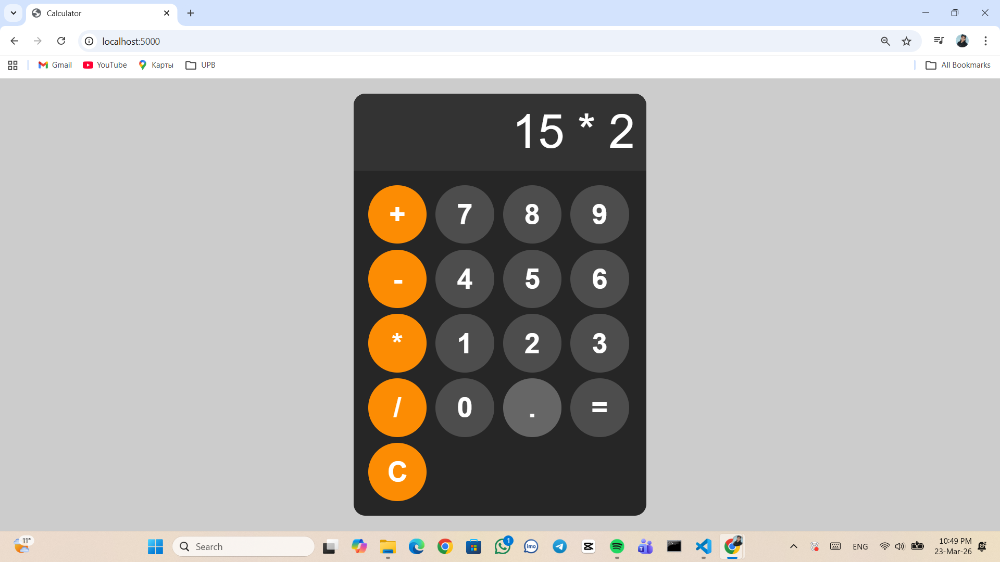

# Calculator Web App

Simple calculator built with HTML, CSS, JavaScript and Flask.

## Features

- Basic operations (+, -, *, /)
- Error handling with try-catch
- Clean UI design
- Flask backend to serve the app

## Installation

pip install -r requirements.txt
python app.py

## Usage

Open http://127.0.0.1:5000 in your browser

## Screenshot

